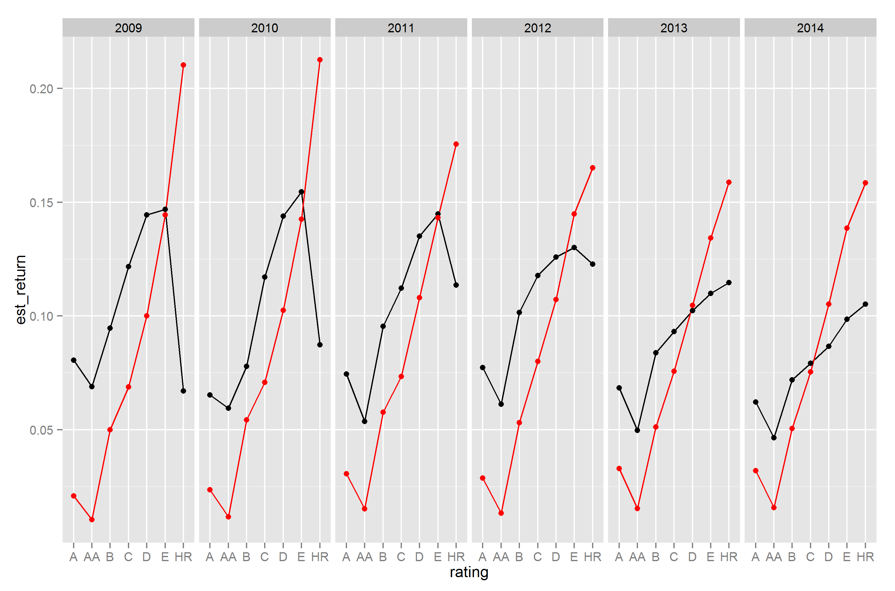
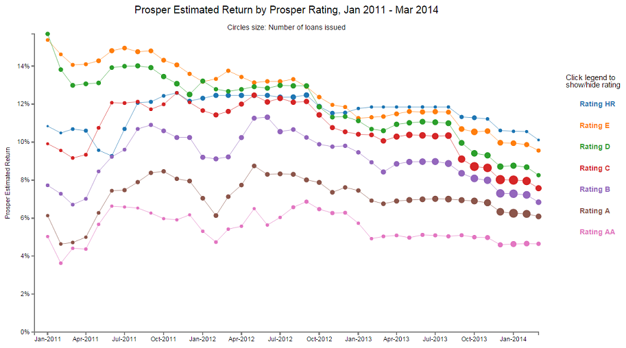
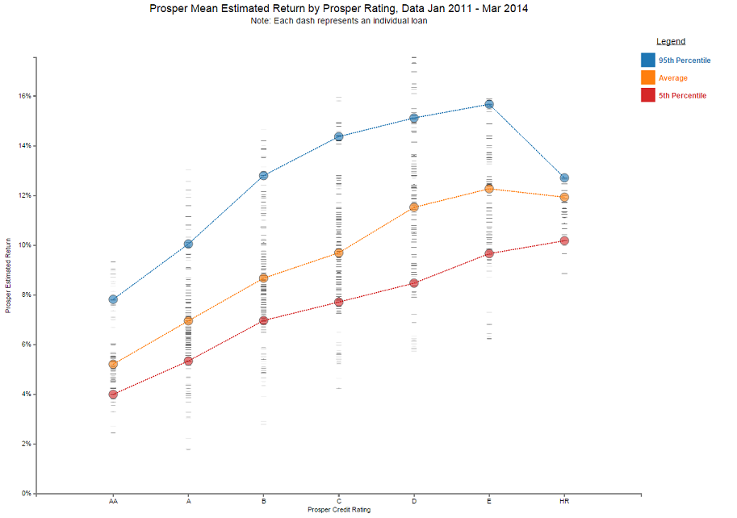
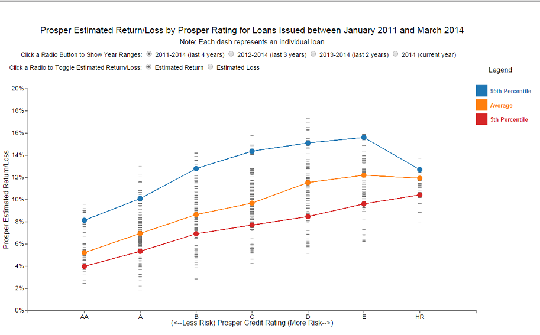

##Data Visualization: Prosper Loan Data
Author: Max Edwards

### Project Summary
This data visualization provides [Prosper.com loan data](https://www.prosper.com/) estimated returns and estimated losses by Prosper Credit Rating between 2011 and 2014. The programming language R was used to clean and explore the raw data file. The data file is available for download [here](https://www.google.com/url?q=https://s3.amazonaws.com/udacity-hosted-downloads/ud651/prosperLoanData.csv&sa=D&usg=AFQjCNGy13Kf5et82IoAUpLX68qW61M8DA). Variable definitions are provided [here](https://docs.google.com/spreadsheets/d/1gDyi_L4UvIrLTEC6Wri5nbaMmkGmLQBk-Yx3z0XDEtI/edit#gid=0). A cleaned version of this file was used to generate the visualization using the d3.js library.

### Visualization Design and Feedback
I approached the development this visualization from the perspective of a potential investor by thinking about what one would be interested in understanding prior investing in a prosper loan.  I believe the first thing an investor would look for is past performance. However, this data did not include actual past performance so I decided to plot estimated returns on the notion that they are a good indicator of past actual performance. By doing this, I am making the assumption Prosper’s algorithm or methodology to calculate their interest rates (the main variable used to derive estimated return) incorporates past performance. For the sake of this project, I believe this is a safe assumption.

#### Explore the Data
Prior to developing the visualization, I loaded the data into R to perform exploratory analysis. The dataset consisted of 113,937 rows and 81 columns. I was able to quickly eliminate a lot of the columns as most of the data would not be available to a prospective investor prior to making an investment. I narrowed down the data down to the following variables:
- `ProsperRating(Alpha)`
- `EstimatedReturn`
- `EstimatedLoss`
- `LoanOriginationDate`

I decided a line chart would be most appropriate to display time-series data and decided to distinguish Prosper’s Rating for the loan by the line color. Below is an example of the one of the exploration charts I made with R's ggplot2 package.

After exploration, I decided to clean the data by making the following adjustments:
- Remove any data prior to 2011. I investigated why 2009 and 2010 looked slightly different in terms of their estimated returns. It turns out Prosper adjusted their method for estimated return calculations starting in 2011. I was unable to normalize 2009 to 2011 as I don't know exactly what they changed. Therefore the chart will show 2011 through March 2014. 
- Change `LoanOriginationDate` into a `year` and `month`. Later, I removed `month` as I only needed `year` after making adjustments to my visualization.

#### Create Visualization with D3.js
Leveraging the plot I created in R, I was able to create the first iteration of my plot with d3.js shown below. The code for this plot is provided in `index_rev1.html`. I decided to use color to distinguish each Prosper Rating and to summarize loans by month into circles for the estimated return. I felt the circles would draw the user to a specific point to look at rather than just a line and I felt the colors would make it easy to distinguish between each loan. I also made it so you could click the legend to toggle display of the line in order control which ratings you want to compare. I also added tooltips to display other useful information on the circles as I thought it be useful if the user wanted to know the exact values and estimated loss values.

A summary of the design choices for the above chart are provided below:
-	**Chart type.** A line chart was utilized as the data being presented is time-series. The user can visualize a trend over the course of time easily. This is opposed to a bar chart (for example) which wouldn't be useful for identifying trends over time.
-	**Visual Encodings.** I encoded the lines to represent the estimated returns by Prosper rating. The lines are shown different colors for the user to easily distinguish between the Ratings. I used circles (scatter points) to represent mean Estimated Returns at a specific month for each Rating. I believe keeping the circles the same color as the line is appropriate as anything else would make the chart cluttered and confusing. Additionally, I encoded the size of the circle to represent the sample size for the specific month. I believe this adds additional useful information as the user has a better idea of how many loans were used to determine the mean return. 
-	**Layout.** I choose standard layout of a y-axis (vertical axis) on the left and a x-axis (horizontal axis) on the bottom. 	The y-axis is scaled to incorporate the maximum loan return and has ticks every 2% so the user can identify the estimated return at a specific point on the chart. I also provided a title to give the user a queue to what they are looking at to make it easier to decipher. I also provided a note under the title to what the size of the circles means.
-	**Legends.** I provided the legend to the right and matched the color of the text with the line to make it easy to decipher. Additionally, I added interaction by allowing the user to click the legend to toggle on/off a specific loan rating. I added this so the user could compare only loans they were interested in by removing loans they were not interested in.
-	**Hierarchy.** The main purpose of the visualization was the show the differences in the loan types over time in terms of their estimated returns. That is why the most prominent layer are the lines showing the estimated returns by rating over time. Next, the singular circles (scatter points) allow the user to pinpoint a specific return at a specific point in time. Finally, a tooltip is provided so the user can view precise metrics. This only appears when the user is hovering over a specific point.

#### First Round of Visualization Feedback
I interviewed three people to collect un-biased feedback in order to improve upon my visualization.  First, I had to explain about Prosper.com and peer to peer lending in general. Then, I asked them with questions. The following section provides each question with a summary of each response for two people (labeled "i" and "ii" after each question). I received feedback from a third person on in a follow-on version after I updated my chart in response to the initial feedback.

- What do you notice in the visualization?
    1. All rating trends are showing decreasing estimated returns
    2. It looks like Skittles "Taste the Rainbow". 
Note: my wife's feedback is a little more useful after her answer (#2).

- What questions do you have about the data?
    1. Why wouldn’t I invest in “HR” Prosper Rating every time? 
    2.  What do the different ratings mean? Why wouldn't I invest in the blue or orange every time?

- What relationships do you notice?
    1. All of the returns show a decreasing trend
    2. All trends are very similar
	
- What do you think is the main takeaway from this visualization?
    1. Prosper has 7 different ratings you can choose from
    2. More loans issued overtime with lower estimated returns by month

- Is there something you don’t understand in the graphic?
	1. As I said before, the graphic is useful to understand the returns for each Prosper Rating over time. I just don't know why I wouldn't invest in	Rating HR (blue line) every time. Also, I noticed I could hover over the points to display a tooltip but found that out by mistake. Maybe indicate that is an option. 
	2. I understood everything. I'd suggest indicating what each Rating actually means. 

#### Next Iteration Visualization with D3.js – Incorporating First Round of Feedback
I quickly realized that my graphic doesn't really help a potential investor after reading the feedback I received. The main issue is that each rating only shows average returns, which of course are higher for the higher risk ratings. That is because given a large enough sample size, estimated average returns should be higher for the higher risk loans by definition (Note: actual returns may be different over a given period). Given the feedback and this realization, I decided to change my approach by creating a graphic that does a better job at showing the variation. The following picture provides my new plot with a Prosper Rating ordinal scale instead of a time series scale. Estimated returns are now shown for each individual loan (represented by the dashes) and summary statistics (5th percentile, 95th percentile, and mean) are shown by the larger colored circles and connected by lines (safe to do because the ratings are ordinal). I thought about adding descriptions for each rating (per my wife's feedback) but I decided against it as a potential user would already have this background information. 

This design changed from my initial design so similarly I will provide the initial design consideration summary. They are shown below: 
-	**Chart type.** A line chart was utilized to show the comparison between the summary statistics (mean, 95th percentile, and 5th percentile) at each rating. I believe this is better than a bar chart considering the scale is ordinal. If it was purely categorical, a line chart would not be appropriate.
-	**Visual Encodings.** I encoded the lines different colors so the user could easily distinguish between the summary statistics. I also provided the scatter plot circles (same color) where the lines crossed to provide singular point of reference at each rating for each summary statistic.
-	**Layout.** I choose standard layout of a y-axis (vertical axis) on the left and a x-axis (horizontal axis) on the bottom. 	The y-axis is scaled to incorporate the maximum loan return and has ticks every 2% so the user can identify the estimated return at a specific point on the chart. I also provided a title to give the user a queue to what they are looking at to make it easier to decipher. I also provided a note under the title to indicate what each "dash" represents.
-	**Legends.** I provided the legend at the top-right and matched the color of the text with the line to make it easy to decipher. I also added the square rectangles so the user is drawn to the legend (the text alone is relatively dull).
-	**Hierarchy.** The main purpose of the visualization was the show the differences in the loan types. That is why the most prominent layer are the lines. Next, the singular circles (scatter points) allow the user to pinpoint a specific return for a specific Prosper rating. Then, the "dash" marks provide an idea of amount of loans the general variation in the estimated returns individually.

#### Second Round of Visualization Feedback 
Similar to the First Round of Visualization Feedback, I provided context and questions to be answered. This time, I had one person provide feedback. The question/answers are provided below.

- What do you notice in the visualization?
    1. The first thing that drew my attention was the vertical lines that look like a barcode. I read the title of the chart and realized what those represented. I think the title needs some work as this shows more than just the mean. I think the axis labels are too small in comparison to the title and legend.

- What questions do you have about the data?
    1. How many loans were actually issued? It's hard to tell. Are there actual returns available instead of estimated? Is there a way to split out the data by year? Maybe each year shows something different.

- What relationships do you notice?
    1. The more risk, the more reward (higher estimated return). 

- What do you think is the main takeaway from this visualization?
    1. There are seven Prosper Credit rating loans to choose from. E rating returns show the highest estimated returns although individual loans tend to vary.

- Is there something you don’t understand in the graphic?
	1. What's the difference between the loans? I'm assuming there is higher risk of default on the loans with higher estimated returns (as they would garner a higher interest rate). There isn't anything that tells me default risk.

### Final Iteration Visualization with D3.js – Incorporating Second Round of Feedback
After my Second Round (third person) feedback session, I realized I needed to make the following changes:
- Add an element that shows risk for each Prosper Rating. To address this change, I added radio buttons to allow the user to click between viewing estimated returns and estimated loss. The data/display updates accordingly.
- Adjust title and label aesthetics. To address this issue, I edited the title and increased font sizes for the axes.
- Split out data showing the last 4, 3, 2, and 1 year(s). I didn't do individual years as I believe historical trends are more useful. There are radio buttons the user can click to switch between views. The data/display updates accordingly.
- Change the code to better address enter/update/exit transition (I removed a lot of duplicate code). I realized I was doing this poorly. I've never used JavaScript before this project and I'm still high on the learning curve. 
The changes are shown in the following picture or live in `index-final.html`

### References
1.	[AlignedLeft - Scott Murray](http://alignedleft.com/tutorials/d3)
2.	[Stackoverflow](http://stackoverflow.com)
3.  [Mike Bostock d3](https://github.com/mbostock/d3/)
4.  http://bl.ocks.org/
